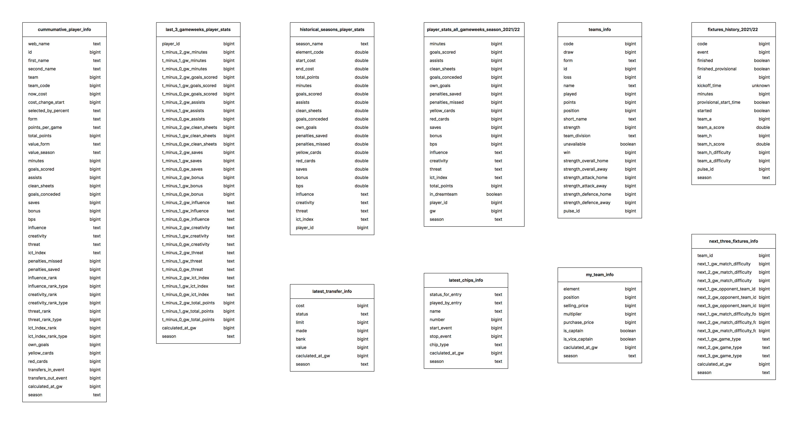

# FANTASY PREMIER LEAGUE DATA

Almost every football fan knows what Fantasy Premier League (FPL) is. Here is a [link](https://www.premierleague.com/news/2173986) with the basics in case you don't. FPL is a very data driven game with a lot of analysis involved like which player to transfer in or transfer out, which player to captain, which player to keep on the bench etc. FPL Data the perfect playground for performing exploratory analysis, building ML models, and building Optimization Models.

This is a script that helps automatically fetch Fantasy Premier League Data for each gameweek and stores it in a SQLite DB. The main purpose of fetching this data and cleaning it is for use in building ML and Optimization models that can help automatically build teams for each gameweek. It can be scheduled to run every week after the fixtures for that week is over.  
Apart from fetching the raw data and cleaning it, the script also performs some useful transformations on the data to create variables that might be useful later on for building models.

Table Schema:

